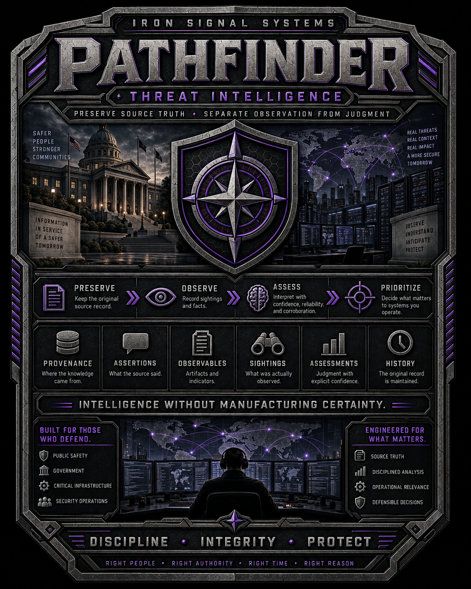

# Pathfinder

<p align="center">
  
</p>

**Pathfinder by Iron Signal Systems**

Pathfinder is a threat-intelligence and operational-correlation system.

Its purpose is to preserve what intelligence sources said, preserve what authorized sensors actually observed, and let Pathfinder determine where those two bodies of information intersect without turning correlation into manufactured certainty.

Pathfinder is pre-release and under active development.

## Mission

Pathfinder should help an operator answer:

1. **What do we know about this threat or observable?**
2. **Where did that knowledge come from?**
3. **What have we actually observed in our environment?**
4. **Does the intelligence apply to those observations?**
5. **Has new intelligence changed how we should interpret historical activity?**
6. **Why did Pathfinder reach that interpretation?**

> **Pathfinder owns the organization's record and interpretation of threat intelligence.**

Pathfinder is authoritative for the intelligence records, provenance, processing history, correlations, and assessments it creates and maintains. It is not automatically authoritative for the real-world truth of an external assertion.

## Core Operating Model

Pathfinder preserves three distinct categories:

```text
WHAT THE SOURCE SAID
    preserved source material
    attributable Assertions

WHAT WAS OBSERVED
    sensor observations
    Sightings from identified observation authorities

WHAT PATHFINDER UNDERSTOOD
    normalized intelligence
    Relationships
    correlation results
    applicability
    Assessments
```

These categories must remain distinguishable.

```text
source assertion != established fact
observable != malicious
sighting != compromise
correlation != identity
association != attribution
confidence != authorization
new intelligence != rewritten history
```

## The Operational Intelligence Loop

Pathfinder is being built around one complete loop:

```text
External / Internal Threat Intelligence
              |
              v
      Source Preservation
              |
              v
   Assertions / Observables
              |
              |
              +-----------------------------+
                                            |
                                            v
Pathfinder Sensors                    Correlation
      |                                     |
      v                                     v
Observed Network Activity -------> Applicability
      |                                     |
      v                                     v
Sensor Observation Store --------> Assessment
                                            |
                                            v
                                  Historical Reprocessing
```

A sensor can tell Pathfinder:

```text
endpoint A contacted example.net
at time T
using protocol/port P
with TLS SNI example.net
```

A threat source can separately tell Pathfinder:

```text
Source X reports example.net
served as command-and-control
for Campaign Y
during period Z
and affected platform Q
```

Pathfinder's job is to preserve both records, determine whether they intersect, determine whether the assertion is applicable to the specific Sighting, and create a traceable Assessment.

The sensor does **not** decide that the traffic was malicious.

The source does **not** prove that the observed traffic was malicious.

Pathfinder does **not** silently collapse those facts into one truth value.

## Current Architecture

Pathfinder is organized conceptually into three data planes.

```text
THREAT INTELLIGENCE PLANE
    Source
    SourceCollection
    RetrievalEvent
    SourceArtifact
    SourceRecord
    Assertion
    Observable
    Indicator
    Campaign
    Malware
    Infrastructure
    Vulnerability
    Relationship
    Report
            |
            | correlation
            v
INTERPRETATION PLANE
    Sighting
    Assessment
    IntelligenceConflict
    applicability
    lifecycle
    historical reprocessing
    processing/change/audit history
            ^
            |
            | observations
            |
SENSOR OBSERVATION PLANE
    sensor identity
    endpoint identity
    IP / port / protocol
    DNS
    TLS SNI
    NAT / observed path
    conntrack
    observation time
    vantage/interface
    sensor health
    coverage state
```

The stores may share a PostgreSQL deployment initially, but the semantic domains remain separate. High-volume sensor observations must not be collapsed into the threat-intelligence tables merely because they can be represented relationally.

See [`docs/OPERATIONAL-INTELLIGENCE-ARCHITECTURE.md`](docs/OPERATIONAL-INTELLIGENCE-ARCHITECTURE.md).

## Why Sensor Data Belongs in Pathfinder

Pathfinder is not collecting network observations so it can become a general monitoring platform.

Sensor data exists to make threat intelligence operational.

It lets Pathfinder answer questions such as:

```text
Have we ever seen this domain?

Which endpoints contacted this infrastructure?

When did the observations occur?

What SNI or DNS context was visible?

What endpoint identity existed at the time?

Does the campaign's affected platform match the observed endpoint?

Did the observation occur during the intelligence validity window?

What did we know then?

What do we know now?

Which historical observations deserve another look?
```

This makes historical reprocessing a first-class capability.

New intelligence may change Pathfinder's current Assessment of an old Sighting. It must never rewrite the original Sighting or make later knowledge appear to have existed earlier.

See [`docs/CORRELATION-HISTORICAL-REPROCESSING.md`](docs/CORRELATION-HISTORICAL-REPROCESSING.md).

## Pathfinder Is Not a SIEM

Pathfinder intentionally does not aim to become the organization's general-purpose event lake.

Pathfinder is not being designed as the primary home for:

```text
all Windows event logs
all Linux syslog
generic application logs
VPN login dashboards
switch health logs
generic firewall event streams
SOC case-management queues
general infrastructure monitoring
```

A narrow observation may enter Pathfinder when it materially supports a threat-intelligence Sighting or applicability decision.

The distinction is purpose:

```text
SIEM
    What security events are happening across the environment?

PATHFINDER
    What does our threat intelligence mean,
    what have we actually observed,
    and where do those two intersect?
```

## Sensor Direction

The first supported sensor is the UniFi UDM-Pro sensor under:

```text
sensors/unifi/udm-pro
```

It currently provides directly observed or explicitly derived network context including:

```text
packet observations
DNS observations
plaintext TLS SNI when visible
endpoint identity history
conntrack history
NAT correlation
observed LAN-to-WAN path correlation
sensor health
bounded compressed local history
diagnostic historical queries
```

The local sensor ring is primarily for delivery resilience, short-term source record, validation, and sensor troubleshooting.

Normal broad historical operator queries are intended to run against the Pathfinder server's indexed sensor observation store rather than repeatedly scanning the sensor's local compressed ring.

See [`docs/SENSOR-OBSERVATION-INGESTION.md`](docs/SENSOR-OBSERVATION-INGESTION.md) and [`sensors/unifi/udm-pro/README.md`](sensors/unifi/udm-pro/README.md).

## Source Preservation

The canonical intelligence-source path remains:

```text
Source
  |
  v
SourceCollection
  |
  v
RetrievalEvent
  |
  v
SourceArtifact
  |
  v
SourceRecord
  |
  v
Assertion
  |
  v
normalized Pathfinder intelligence
```

A `SourceArtifact` preserves exact acquired source bytes at the defined preservation boundary.

A `SourceRecord` is a logical source item represented within that artifact.

```text
SourceArtifact != SourceRecord
SourceRecord   != Assertion
Assertion      != Assessment
```

> **Preserve what was received before deciding what it means.**

## Core Intelligence Objects

```text
SOURCE / PROVENANCE
    Source
    SourceCollection
    RetrievalEvent
    SourceArtifact
    SourceRecord

INTELLIGENCE
    Assertion
    Observable
    Indicator
    Sighting
    Assessment
    Relationship
    ThreatActor
    Campaign
    Malware
    Tool
    Vulnerability
    Technique
    Infrastructure
    Report

INTELLIGENCE STATE
    LifecycleEvent
    IntelligenceConflict

SYSTEM HISTORY
    ChangeRecord
    ChangeSet
    AuditEvent
    ProcessingRecord
```

Important distinctions:

```text
Assertion
    attributable claim

Observable
    neutral canonical value

Sighting
    recorded observation

Assessment
    Pathfinder-recorded judgment

Relationship
    governed connection between intelligence objects
```

An external statement that an IP is C2 is an `Assertion`.

A sensor observing communication with that IP is a `Sighting`.

Pathfinder deciding that the external assertion is applicable to that historical Sighting is an `Assessment`.

## Permanent History

> **The original record is maintained no matter what.**

Pathfinder uses forward-moving historical semantics.

```text
revoked     != deleted
superseded  != deleted
disputed    != deleted
expired     != benign
new finding != rewritten old record
```

New threat intelligence may trigger historical reprocessing. Reprocessing creates new processing lineage and, where justified, new Assessments. It does not alter the source record or the original sensor observation.

## Confidence, Reliability, and Corroboration

Pathfinder does not reduce intelligence quality to one unexplained score.

It keeps separate:

```text
source reliability
source-reported confidence
Pathfinder Assessment confidence
analyst confidence
corroboration
age / recency
operational relevance
applicability
```

Repeated delivery of one upstream report does not become independent corroboration.

Repeated Sightings do not themselves prove maliciousness.

## STIX, TAXII, and ATT&CK

STIX 2.1 and TAXII 2.1 are interoperability boundaries, not Pathfinder's internal truth model.

```text
valid STIX != trusted intelligence
successful TAXII transport != intelligence accepted
```

MITRE ATT&CK remains optional classification/reference metadata.

> **ATT&CK is a classification aid, not a prerequisite for understanding or proving a compromise.**

## ISS Product Boundaries

```text
Atlas
    asset/environment authority

FI
    file and file-system observation authority

Stronghold
    authoritative network observation and enforcement for Stronghold deployments

Pathfinder Sensors
    authority for what each identified sensor directly observed at its vantage

Pathfinder
    threat-intelligence record, correlation, applicability, and interpretation

Guidon
    backup/recovery authority
```

Integration shares information. It does not transfer domain authority.

A Pathfinder sensor observation does not become authoritative full-packet history. Stronghold full PCAP does not become a Pathfinder conclusion. FI file observations do not become compromise conclusions. Atlas context does not make Pathfinder the asset authority.

## Current Development Status

The completed foundation is retained:

```text
Phase 0
    threat-intelligence semantics and contracts
    COMPLETE

Phase 1.1
    runtime and repository foundation
    COMPLETE

Phase 1.2
    source foundation / minimal relational schema
    COMPLETE

Phase 1.3
    exact source preservation
    COMPLETE

Phase 1.4
    first external collector — CISA KEV
    COMPLETE
```

The implementation roadmap was reset on 2026-09-15 after validating the UDM-Pro sensor and clarifying Pathfinder's operational-correlation role.

Current implementation begins with:

```text
Phase 1.5 — Observable Normalization
```

The immediate objective is not broad feed count or UI breadth. It is one trustworthy end-to-end path:

```text
threat source
  -> preserved Assertion
  -> normalized Observable
  -> sensor observation
  -> Sighting
  -> correlation
  -> applicability
  -> Assessment
  -> historical reprocessing
  -> explainable query result
```

See [`ROADMAP.md`](ROADMAP.md).

## Governing Documentation

Current implementation direction:

- [`ROADMAP.md`](ROADMAP.md)
- [`docs/OPERATIONAL-INTELLIGENCE-ARCHITECTURE.md`](docs/OPERATIONAL-INTELLIGENCE-ARCHITECTURE.md)
- [`docs/SENSOR-OBSERVATION-INGESTION.md`](docs/SENSOR-OBSERVATION-INGESTION.md)
- [`docs/CORRELATION-HISTORICAL-REPROCESSING.md`](docs/CORRELATION-HISTORICAL-REPROCESSING.md)

Existing Phase 0 documents remain the semantic foundation unless a later committed reconciliation explicitly refines them. The reset changes implementation priority; it does not erase completed design history.

## Engineering Direction

Pathfinder follows the Iron Signal Systems engineering philosophy:

```text
explicit boundaries
truthful state reporting
minimal justified dependencies
narrow inspectable implementations
failure behavior designed with the success path
no manufactured certainty
no hidden authority transfer
permanent original history
rebuildable derived views
```

See [`AGENTS.md`](AGENTS.md) for repository-wide contributor rules.

## Security

See [`SECURITY.md`](SECURITY.md) for vulnerability reporting and project security scope.

## License

Pathfinder is proprietary source-available software, not open-source software.

See [`LICENSE`](LICENSE) for permitted evaluation use and restrictions.

---

> **Preserve the source. Preserve the observation. Preserve the original record. Preserve uncertainty. Re-evaluate interpretation without rewriting history.**
